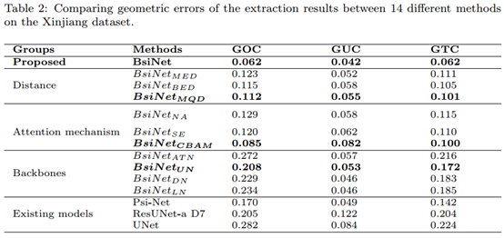

# BsiNet

Official Pytorch Code base for [Delineation of agricultural fields using multi-task BsiNet from high-resolution satellite images]

[Project](https://github.com/long123524/BsiNet-torch)

## Introduction

This paper presents a new multi-task neural network BsiNet to delineate agricultural fields from remote sensing images. BsiNet learns three tasks, i.e., a core task for agricultural field identification and two auxiliary tasks for field boundary prediction and distance estimation, corresponding to mask, boundary, and distance tasks, respectively. 

<p align="center">
  
</p>

<p align="center">
  
</p>

<p align="center">
  
</p>


## Using the code:

The code is stable while using Python 3.7.0, CUDA >=11.0

- Clone this repository:
```bash
git clone https://github.com/long123524/BsiNet-torch
cd BsiNet-torch
```

To install all the dependencies using conda or pip:

```
PyTorch
TensorboardX
OpenCV
numpy
tqdm
```

## Preprocessing
Contour and Distance Maps are pre-computed and can be obtained from binary mask and contour. You can use matlab or python codes to obtain them.

## Data Format

Make sure to put the files as the following structure:

```
inputs
└── <train>
    ├── image
    |   ├── 001.tif
    │   ├── 002.tif
    │   ├── 003.tif
    │   ├── ...
    |
    └── mask
    |   ├── 001.tif
    |   ├── 002.tif
    |   ├── 003.tif
    |   ├── ...
    └── contour
    |   ├── 001.tif
    |   ├── 002.tif
    |   ├── 003.tif
    |   ├── ...
    └── dist_contour
    |   ├── 001.mat
    |   ├── 002.mat
    |   ├── 003.mat
    └── ├── ...
```

For test and validation datasets, the same structure as the above.

## Training and testing

1. Train the model.
```
python train.py --train_path ./fields/image --save_path ./model --model_type 'bsinet' --distance_type 'dist_contour' 
```
2. Evaluate.
```
python test.py --model_file ./model/150.pt --save_path ./save --model_type 'bsinet' --distance_type 'dist_contour' --val_path ./test_image
```

If you have any questions, you can contact us: Jiang long, hnzzyxlj@163.com and Mengmeng Li, mli@fzu.edu.cn.

## GF dataset
A GF2 image (1m) is provided for scientific use: https://pan.baidu.com/s/1isg9jD9AlE9EeTqa3Fqrrg, password：bzfd

### Acknowledgements:

This code-base uses certain code-blocks and helper functions from Psi-Net

### Citation:
```
Long J, Li M, Wang X, et al. Delineation of agricultural fields using multi-task BsiNet from high-resolution satellite images[J]. International Journal of Applied Earth Observation and Geoinformation, 2022, 112: 102871.
```
