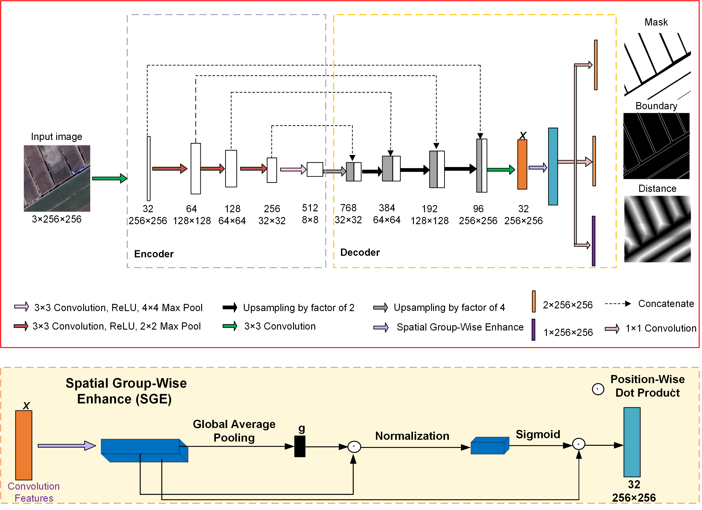

# BsiNet

Official Pytorch Code base for [Delineation of agricultural fields using multi-task BsiNet from high-resolution satellite images]

[Project](https://github.com/long123524/BsiNet-torch)

## Introduction

This paper presents a new multi-task neural network BsiNet to delineate agricultural fields from high-resolution satellite images. BsiNet is modified from a PsiNet by structuring three parallel decoders into a single encoder to improve computational efficiency. BsiNet learns three tasks, i.e., a core task for agricultural field identification and two auxiliary tasks for field boundary prediction and distance estimation, corresponding to mask, boundary, and distance tasks, respectively. A spatial group-wise enhance (SGE) module is incorporated to the BsiNet to improve the identification of small fields.

<p align="center">
  
</p>


## Using the code:

The code is stable while using Python 3.7.0, CUDA >=11.0

- Clone this repository:
```bash
git clone https://github.com/long123524/BsiNet-torch
cd BsiNet-pytorch
```

To install all the dependencies using conda or pip:

```
PyTorch
TensorboardX
OpenCV
numpy
tqdm
```

## Data Format

Make sure to put the files as the following structure:

```
inputs
└── <train>
    ├── image
    |   ├── 001.tif
    │   ├── 002.tif
    │   ├── 003.tif
    │   ├── ...
    |
    └── masks
    |   ├── 001.tif
    |   ├── 002.tif
    |   ├── 003.tif
    |   ├── ...
    └── contour
    |   ├── 001.tif
    |   ├── 002.tif
    |   ├── 003.tif
    |   ├── ...
    └── dist_contour
    |   ├── 001.mat
    |   ├── 002.mat
    |   ├── 003.mat
    └── ├── ...
```

For test and validation datasets, the same structure as the above.

## Training and Validation

1. Train the model.
```
will coming soon
```
2. Evaluate.
```
python test.py 
```
We will release  the complete code after receiving our paper

### Acknowledgements:

This code-base uses certain code-blocks and helper functions from [Psi-Net](https://github.com/Bala93/Multi-task-deep-network)


### Citation:
```

```
